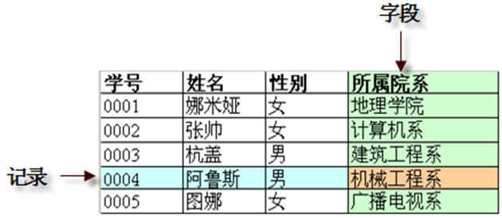
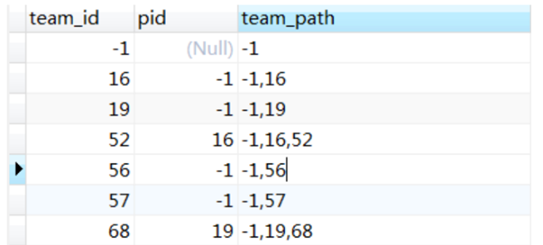
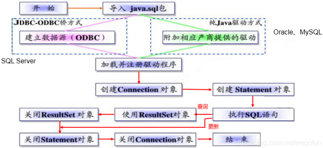

## *仅供参考学习*
这份中文文档包含了本项目代码中一些术语和概念的解释，结尾还有一些讲得很好的博客，可以帮助你快速获取有关***数据库，calcite，avatica，jdbc***等等相关的知识，这将有助你阅读项目中的相关部分的代码。
 
（文档比较无序，建议使用Ctrl+F进行查询） 
（编写者也是初学者，这份文档还在更新中，一些地方可能有错，欢迎你的指正。）
---
## 数据库

数据表：在关系型数据库系统中，一个关系就是一个表，表结构指的是数据库的关系模型。表是若干列（Column）和若干行（Row）的集合，每一行代表一个唯一的记录，每一列代表一个字段(field)，注意每个字段中的数据必须具有相同的数据类型。
  
Column：数据库表的一列

Field：表中的一个字段，记录的一个属性

Metadata：元数据(MetaData),即定义数据的数据.比如,我们要搜索一首歌(歌本身就是数据),可以通过歌名,歌手,专辑等信息来搜索,这些歌名,歌手,专辑就是这首歌的元数据.因此数据库的元数据就是一些注明数据库信息的数据.

Getter：get方法，从当前游标所指行的特定列中get一个值

Accessor：数据访问器

Cursor: 游标，就是游动的标识，可以充当指针的作用，使用游标可以遍历查询数据库返回的结果集（resultset）中的所有记录，但是每次只能提取一条记录，即每次只能指向并取出一行的数据，以便进行相应的操作。
例如：我们写一条select查询语句，按理上会一下子给我们查询出所有的结果。这时候我们想对每一条查询的结果数据进行一条条获取并筛选，这时候我们相当于对查询的结果集进行筛选，那么这个过程就需要使用到游标了进行一行一行的获取数据了。

Rep：一个枚举类，用来对应数据库和java中的数据类型，例如tinyint对应byte；java中不一定有对应的数据类型，例如各种空间对象point对应100001，polygon对应100005

Clazz：==class，因为class是java中的保留关键字，不能用于命名变量，所以使用读音相似的clazz来命名，这是约定俗成的。

Primitive：基本数据类型，Java中包含八种，boolean,char,byte,short,int,long,float,double

Ordinal：序号

DECIMAL（NUMERIC）：我们在Mysql中存字段的时候，比如，一些与金钱有关的数据。这个时候就会对精确到的要求非常高。那么这个时候，就会发现我们之前所学的八大基本类型不再能够满足需求，无论是整形还是浮点型，有人会说存整形有什么不可，但是你要知道不是每个人的金额都是整数的；这样不行的话，存浮点型的就可以了嘛，对于银行存钱来说，一个小数点的问题都会将一笔钱的金额变得很大或者很小…So，这个时候你可以尝试一下Decimal类型，你会发现能够很好地解决你的问题。decimal数据类型用于要求非常高的精确计算中，这些类型允许指定数值的精确度和计算方法作为选择参数。

BigDecimal.valueOf：可以发现如果我们调用BigDecimal.valueOf(0.01)，那么0.01会先被转化为字符串类型的对象，然后再调用new BigDecimal()方法，这样可以保证精度不会丢失，所以BigDecimal.valueOf(0.01)可以理解成等价于new BigDecimal(“0.01”)，但是即使我们要创建一个值为0.01的BigDecimal对象，一般也不可能写new BigDecimal(“0.01”)，太违和了，所以个人建议实例化一个BigDecimal对象，可以尝试习惯使用BigDecimal.valueOf()方法

REAL：就是DOUBLE ，如果SQL服务器模式包括REAL_AS_FLOAT选项，REAL是FLOAT的同义词而不是DOUBLE的同义词。

按照SQL标准的解释，在SQL环境下Catalog和Schema都属于抽象概念，主要用来解决命名冲突问题。从概念上说，一个数据库系统包含多个Catalog，每个Catalog又包含多个Schema，而每个Schema又包含多个数据库对象（表、视图、序列等），反过来讲一个数据库对象必然属于一个Schema，而该Schema又必然属于一个Catalog，这样我们就可以得到该数据库对象的完全限定名称从而解决命名冲突的问题了。

一个Schema中包含多个表. Calcite中的Schema类似于RDBMS中的Database。CatalogReader, 用于指示如何读取Schema信息

Path：存储对象在父子关系中的路径，用于定位查找某一对象。
因为项目里面的组织架构表没有保存组织路径，导致写sql查询不易查询上下级所属的数据，因此在组织架构表里面添加了path字段，用来保存该组织的路径path值，然后写存储过程对已有的数据进行了path值的生成：
 

DDL
（Data Definition Language） 数据定义语言，主要是进行定义/改变表的结构、数据类型、表之间的链接等操作。常用的语句关键字有 CREATE、DROP、ALTER 等。

DML
（Data Manipulation Language）数据操纵语言，主要是对数据进行增加、删除、修改操作。常用的语句关键字有 INSERT、UPDATE、DELETE 等。

DQL
（Data Query Language）数据查询语言，主要是对数据进行查询操作。常用关键字有SELECT、 FROM、WHERE 等。

DCL
（Data Control Language） 数据控制语言，主要是用来设置/更改数据库用户权限。常用关键字有 GRANT、REVOKE 等。

Handle（句柄）：句柄是一种特殊的智能指针 。当一个应用程序要引用其他系统（如数据库、操作系统）所管理的内存块或对象时，就要使用句柄。句柄与普通指针的区别在于，指针包含的是引用对象的内存地址，而句柄则是由系统所管理的引用标识，该标识可以被系统重新定位到一个内存地址上。这种间接访问对象的模式增强了系统对引用对象的控制。

MySQL和NoSQL组合使用：MySQL中只存储需要查询的小字段，NoSQL存储所有数据。

Descriptor：数据属性描述符

Proto：proto文件来预先定义的消息格式。数据包是按照proto文件所定义的消息格式完成二进制码流的编码和解码。proto文件，简单地说，就是一个消息的协议文件，这个协议文件的后缀文件名为“.proto”。

## Calcite

Apache Calcite：是一款开源SQL解析工具, 可以将各种SQL语句解析成语言物管的抽象语法树即AST(Abstract Syntax Tree), 并完成验证、优化，得到物理执行计划后，最后翻译成项目执行引擎（如Hive/Flink）所需的可执行代码。

系统处理sql语句流程：
系统将用户输入的sql语句交给calcite，calcite使用antlr根据g4文件将sql解析成未经检查的AST（抽象语法树，在 Calcite 中用 SqlNode 来表示），然后用schemafactory创建schema并在其中注册元数据，再借助catelogreader读取schema中的metadata对ast进行语法检查，接着用sqltorelconverter将sqlnode转换成relnode（逻辑计划），然后根据一些规则对relnode进行优化，得到物理执行计划，接着再用rextolixtranslator将rexnode转化为linq4j表达式，calcite根据linq4j表达式生成可执行的Java代码，交给 geomesa执行。

Catalog：保存着整个 SQL 的元数据和命名空间，元数据的校验都需要通过 Catalog 组件进行，Catalog 中最关键的几个结构如下：
接口/类				备注

Schema				表和函数的命名空间，是一个多层结构（树结构），Schema 接口虽然存储了元数据，但它本身只提供了查询解析的接口，用户一般需要实现该接口来自定义元数据的注册逻辑。

SchemaPlus		Schema 的拓展接口，它提供了额外的方法，能够显式添加表数据。设计者希望用户使用 SchemaPlus 注册元数据，但不要自己对 SchemaPlus 做新的实现，而是直接使用 calcite 提供的实现类。

CalciteSchema		包装用户自定义的 Schema。

Table				最基础的元数据，通常通过 Schema 的 getTable 得到。

RelDataType			表示一个标量表达式或一个关系表达式返回结果（行）的类型。

RelDataTypeField		代表某列字段的结构。

RelDataTypeSystem	提供关于类型的一些限制信息，如精度、长度等。

RelDataTypeFactory	抽象工厂模式，定义了各种方法以实例化 SQL、Java、集合类型，创建这些类型都实现了 RelDataType 接口。
这些结构大致可以分为三类：
元数据管理模式和命名空间；
表元数据信息；
类型系统。

Calcite 的 Catalog 结构复杂，但我们可以从这个角度来理解 Catalog，它是 Calcite 在不同粒度上对元数据所做的不同级别的抽象。首先最细粒度的是 RelDataTypeField，代表某个字段的名字和类型信息，多个 RelDataTypeField 组成了一个 RelDataType，表示某行或某个标量表达式的结果的类型信息。再之后是一个完整表的元数据信息，即 Table。最后我们需要把这些元数据组织存储起来进行管理，于是就有了 Schema。

ANTLR：（全名：ANother Tool for Language Recognition）是基于LL(*)算法实现的语法解析器生成器（parser generator），用Java语言编写，使用自上而下（top-down）的递归下降LL剖析器方法。antlr4 是一款强大的语法分析器生成工具，可用于读取、处理、执行和翻译结构化的文本或二进制文件。它被广泛的应用于学术领域和工业生产实践，是众多语言、工具和框架的基石。

linq4j：一个针对JAVA的linq移植版本，LINQ代表语言集成查询，它允许我们用SQL查询数据库的方式来查询数据的集合。
在 EnumerableRel的每个算子的 implement 方法中会将一些算子（Group、join、sort、function）要实现的算法写成 Linq4j 的表达式，然后通过这些 Linq4j 表达式生成 Java Class。calcite 会将 sql 生成的 linq4j 表达式生成可执行的 Java 代码（Bindable 类）
Calcite 会调用 Janino 编译器动态编译这个 java 类，并且实例化这个类的一个对象，然后将其封装到 CalciteSignature 对象中。调用executorQuery 查询方法并创建 CalciteResultSet 的时候会调用 Bindable 对象的 bind 方法,这个方法返回一个Eumerable对象，将 Enumerable 赋值给 CalciteResultSet 的 cursor 成员变量。

Adapter：适配器，对calcite进行功能扩展。A schema adapter allows Calcite to read particular kind of data, presenting the data as tables within a schema.

RexNode：（Rex：Row-level expression）行表达式（标量表达式），蕴含的是对一行数据的处理逻辑，通常包含在 RelNode 中。每个行表达式都有数据的类型。这是因为在 Valdiation 的过程中，编译器会推导出表达式的结果类型。常见的行表达式包括字面量 RexLiteral， 变量 RexVariable， 函数或操作符调用 RexCall 等。 RexNode 通过 RexBuilder 进行构建。
rexLiteral：常量表达式
rexCall: 一个操作符和零或多个表达式作为操作数组成的表达式
例如一句SQL： time  <  20。
其中time为RexInputRef，20为RexLiteral，time<20 和 < 为rexcall。

relnode：是一个关系表达式的抽象结构，继承了 RelOptNode 接口，SqlNode 是从 sql 语法角度解析出来的一个个节点，而 RelNode 则是从关系代数这一角度去表示其逻辑结构，并用于之后的优化过程中决定如何执行查询。

语法检查：经过sql解析，会生成一个 SqlNode 对象，它是一个未经验证的抽象语法树，下面就进入了一个语法检查阶段， 语法检查前需要知道元数据信息，这个检查会包括 表名、字段名、函数名、数据类型的检查。Calcite 本身是不管理和存储元数据的，在检查之前， 需要先把元信息注册到 Calcite 中，一般的操作方法是实现 SchemaFactory， 由它去创建相应的 Schema，在 Schema 中可以注册相应的元数据信息。

A RelOptPlanner is a query optimizer: it transforms a relational expression into a semantically equivalent relational expression, according to a given set of rules and a cost model.

RelOptCluster：palnner 运行时的环境，保存上下文信息；

Call：调用

Avatica：是一个构建数据库Driver的框架。作为Calcite的子项目，提供JDBC、ODBC标准的数据库驱动，通过该项目，我们可以自由构建自研数据库的java驱动。

## JDBC

JDBC：（Java DataBase Connectivity）Java数据库连接技术。具体讲就是通过Java连接广泛的数据库，并对表中数据执行增、删、改、查等操作的技术。jdbc是一个规范（接口）而不是一个实现（类），由Sum公司提供一套完整的接口，由数据库厂商根据特点予以实现。为什么JDBC只有接口，没有提供实现？不同数据库的底层技术不同，不少数据库是闭源的，源代码不公开的。Sun公司无力为所有数据库提供具体实现，只能提供接口而由数据库厂商提供具体实现，Sun公司只是制定JDBC标准，各个厂商准守标准提供具体的实现。JDBC和数据库实现的关系就好比List接口和ArrayList、LinkedList之间的关系
 
 

使用JDBC连接数据库并进行查询流程：
系统使用avatica构建数据库驱动，借助JDBC连接mysql，创建connection，再借助calcite创建statement发送sql查询语句到数据库，查询结果返回到resultset中，后续对resultset中数据的操作借助cursor实现。

ResultSet：(JDBC处理数据库的接口)是我们使用jdbc连接时，查询的一个返回结果集,ResultSet resultSet = stmt.executeQuery(sql)

Statement：是 Java 执行数据库操作的一个重要接口，用于在已经建立数据库连接的基础上，向数据库发送要执行的SQL语句。Statement对象，用于执行不带参数的简单SQL语句（用于执行静态 SQL 语句并返回它所生成结果的对象。

PreparedStatement：继承自Statement,都是接口。区别：PreparedStatement可以使用占位符，是预编译的，批处理比Statement效率高。

CallableStatement：是Statement接口的子接口，可以接收过程的返回值，主要用于调用数据库中的存储过程。

Connection：建立与数据库的连接，可以创建数据库连接对象statement或preparedstatement

queryProvider = connection

## 杂

Assert：断言(assert)语句一半用于程序不准备通过捕获异常来处理的错误。
assert booleanExpression; 值为true时，程序从断言语句处继续执行;值为false时，程序从断言语句处停止执行。

Calendar：它为特定瞬间与一组诸如 YEAR、MONTH、DAY_OF_MONTH、HOUR 等日历字段之间的转换提供了一些方法，并为操作日历字段（例如获得下星期的日期）提供了一些方法。

@JsonCreator注解：其作用就是，指定对象反序列化时的构造函数或者工厂方法，如果默认构造函数无法满足需求，或者说我们需要在构造对象时做一些特殊逻辑，可以使用该注解。该注解需要搭配@JsonProperty使用。

.Values()
枚举类中的元素是无法通过下标值来访问的，如果你想指定访问枚举类中的某个值，你只能直接写出它们的值，除此之外，别无他法。但是枚举类有一个values()方法，这个方法可以将枚举类转换成一个枚举类型的数组，转换成数组之后我们就可以通过下标来访问我们的枚举类中的值。比如下面的代码：
enum Direction { LEFT, RIGHT, UP, DOWN }
这里面有四个值，如果我们想通过下标来访问的话，就必须进行如下的操作：
Direction dirs[] = Direction.values();
for (int i = 0; i < dirs.length; i++) {
System.out.println(dirs[i]);}

Collections.unmodifiableMap()
返回指定映射的不可修改视图。通俗的讲就是：产生一个只读的Map，当你调用此map的put方法时会抛错。Java.util.Collections是一个集合工具类，用于操作LIst，Set，Map等集合。Collections类提供了一系列的静态方法，可以实现对集合元素的排序，添加一些元素，随机排序，替换等操作。

Object类：是Javajava.lang包下的核心类，Object类是所有类的父类，何一个类时候如果没有明确的继承一个父类的话，那么它就是Object的子类

反射就是把Java类中的各个组成部分进行解剖，并映射成一个个的Java对象，拿到这些对象后可以做一些事情。例如，一个类有：构造方法，方法（method），成员变量(字段，field)，等信息，利用反射技术咱们可以把这些组成部分映射成一个个对象。拿到映射后的构造方法，可以用它来生成对象；拿到映射后的方法，可以调用它来执行对应的方法；拿到映射后的字段，可以用它来获取或改变对应字段的值。

Hashcode：哈希值是用来查找的，例如内存中有这样的位置：0  1  2  3  4  5  6  7  
而我有个类，这个类有个字段叫ID,我要把这个类存放在以上8个位置之一，如果不用hashcode而任意存放，那么当查找时就需要到这八个位置里挨个去找，或者用二分法一类的算法。但如果用hashcode那就会使效率提高很多。我们这个类中有个字段叫ID,那么我们就定义我们的hashcode为ID％8，然后把我们的类存放在取得得余数那个位置。比如我们的ID为9，9除8的余数为1，那么我们就把该类存在1这个位置，如果ID是13，求得的余数是5，那么我们就把该类放在5这个位置。这样，以后在查找该类时就可以通过ID除 8求余数直接找到存放的位置了。
但是如果两个类有相同的hashcode怎么办那（我们假设上面的类的ID不是唯一的），例如9除以8和17除以8的余数都是1，那么这是不是合法的，回答是：可以这样。那么如何判断呢？在这个时候就需要定义 equals了。也就是说，我们先通过 hashcode来判断两个类是否存放某个桶里，但这个桶里可能有很多类，那么我们就需要再通过 equals 来在这个桶里找到我们要的类。那么，重写了equals()，为什么还要重写hashCode()呢？想想，你要在一个桶里找东西，你必须先要找到这个桶啊，你不通过重写hashcode()来找到桶，光重写equals()有什么用啊。
归纳一下就是hashCode是用于查找使用的，而equals是用于比较两个对象是否相等的。

Moniker：实际上一个Moniker就是系统生成的一个对象，你可以利用该对象找到另一对象或者从中获取数据。

This ()：只能出现在构造方法的第一行，通过当前的构造方法去调用“本类”中的对应的构造方法，目的是：代码复用。

Super（）：在类的继承中，子类的构造方法中默认会有super()语句存在，相当于执行父类的相应构造方法中的语句

context：提供所处上下文环境

GeoJSON是一种对地理数据结构进行编码的格式。GeoJSON对象可以表示几何信息、要素或者要素集合。

Factory：工厂模式，将创建对象的具体过程屏蔽隔离起来，从而达到更高的灵活性。在面向对象编程中，创建对象实例最常用的方式就是通过 new 操作符构造一个对象实例，但在某些情况下，new 操作符直接生成对象会存在一些问题。举例来说，对象的创建需要一系列的步骤：可能需要计算或取得对象的初始位置、选择生成哪个子对象实例、或在生成之前必须先生成一些辅助对象。 在这些情况，新对象的建立就是一个 “过程”，而不仅仅是一个操作，就像一部大机器中的一个齿轮传动。针对上面这种情况，我们如何轻松方便地构造对象实例，而不必关心构造对象示例的细节和复杂过程？解决方案就是使用一个工厂类来创建对象。

Flink流批一体：虽然Flink底层DataStream和DataSet的API是分开的，但你可以使用高层次的关系型API——TableAPI和SQL，实现流批一体的分析。Table API是一个在Scala和Java之上的LINQ （language-integrated query, 语言集成查询） API。你无须修改查询就可以将其用于批或流的分析之中。Table API提供了通用的算子来完成关系型查询，其中包括选择、投影、聚合 及连接等，此外还支持IDE 自动补全和语怯验证。Flink SQL遵循ANSI SQL标准，并借助Apache Calcite来完成查询解析和优化。 Flink为批式和流式查询提供了统一的语法和语义。由于对用户自定义函数的良好支持，很多用例都可以直接用SQL来完成。你可以将SQL查询嵌入到常规的Flink DataSet或DataStream程序中，或使用SQL CLI客户端直接将 SQL查询提交到Flink集群上。
 

## 学习博客
【Jackson】@JsonCreator 注解_绝世好阿狸的博客-CSDN博客 
<https://blog.csdn.net/u010900754/article/details/105859959?ops_request_misc=&request_id=&biz_id=102&utm_term=JsonCreator&utm_medium=distribute.pc_search_result.none-task-blog-2~all~sobaiduweb~default-1-105859959.142%5ev65%5ejs_top,201%5ev3%5econtrol_2,213%5ev2%5et3_control1&spm=1018.2226.3001.4187>
  
java 中 BigDecimal 详解_这辈子_安静的努力着的博客-CSDN博客 
<https://blog.csdn.net/qq_35868412/article/details/89029288?ops_request_misc=%257B%2522request%255Fid%2522%253A%2522166877763116782428616427%2522%252C%2522scm%2522%253A%252220140713.130102334..%2522%257D&request_id=166877763116782428616427&biz_id=0&utm_medium=distribute.pc_search_result.none-task-blog-2~all~top_positive~default-1-89029288-null-null.142%5ev65%5ejs_top,201%5ev3%5econtrol_2,213%5ev2%5et3_control1&utm_term=bigDecimal&spm=1018.2226.3001.4187>
  
mysql中游标的使用案例详解（学习笔记）_徐守威的博客-CSDN博客 
<https://blog.csdn.net/xushouwei/article/details/52201360>
  
元数据(MetaData)学习_chenkefo的博客-CSDN博客 
<https://blog.csdn.net/chenkefo/article/details/81901776?ops_request_misc=&request_id=&biz_id=102&utm_term=%E6%95%B0%E6%8D%AE%E5%BA%93%20metadata&utm_medium=distribute.pc_search_result.none-task-blog-2~all~sobaiduweb~default-3-81901776.142%5ev65%5ejs_top,201%5ev3%5econtrol_2,213%5ev2%5et3_control1&spm=1018.2226.3001.4187>
  
MySQL的10种常用数据类型_IT小谷的博客-CSDN博客 
<https://blog.csdn.net/java_atguigu/article/details/124496058?ops_request_misc=%257B%2522request%255Fid%2522%253A%2522166891049416782390563186%2522%252C%2522scm%2522%253A%252220140713.130102334..%2522%257D&request_id=166891049416782390563186&biz_id=0&utm_medium=distribute.pc_search_result.none-task-blog-2~all~top_click~default-3-124496058-null-null.142%5ev65%5ejs_top,201%5ev3%5econtrol_2,213%5ev2%5et3_control1&utm_term=mysql%E6%95%B0%E6%8D%AE%E7%B1%BB%E5%9E%8B&spm=1018.2226.3001.4187>
  
Java中hashCode的作用_冯立彬的博客-CSDN博客 
<https://blog.csdn.net/fenglibing/article/details/8905007?ops_request_misc=%257B%2522request%255Fid%2522%253A%2522166891435616800186594051%2522%252C%2522scm%2522%253A%252220140713.130102334..%2522%257D&request_id=166891435616800186594051&biz_id=0&utm_medium=distribute.pc_search_result.none-task-blog-2~all~top_positive~default-1-8905007-null-null.142%5ev65%5ejs_top,201%5ev3%5econtrol_2,213%5ev2%5et3_control1&utm_term=hashcode&spm=1018.2226.3001.4187>
  
Calcite-学习笔记（入门篇）_R&Y的博客-CSDN博客 
<https://blog.csdn.net/qq_34226628/article/details/124487489?ops_request_misc=&request_id=&biz_id=102&utm_term=calcite&utm_medium=distribute.pc_search_result.none-task-blog-2~all~sobaiduweb~default-0-124487489.142%5ev65%5ejs_top,201%5ev3%5econtrol_2,213%5ev2%5et3_control1&spm=1018.2226.3001.4187>
  
calcite sqlNode 和relNode 区别_拯救大黄的博客-CSDN博客 
<https://blog.csdn.net/weixin_41163951/article/details/122278187?ops_request_misc=&request_id=&biz_id=102&utm_term=rexliteral&utm_medium=distribute.pc_search_result.none-task-blog-2~all~sobaiduweb~default-3-122278187.142%5ev66%5ejs_top,201%5ev3%5econtrol_2,213%5ev2%5et3_control1&spm=1018.2226.3001.4187>
  
【Calcite】Apache Calcite 框架初探及概念详解_董嘻嘻的博客-CSDN博客 
<https://blog.csdn.net/yiyezhiqiu167/article/details/120833071>
  
Apache Calcite整体架构及处理流程 - Liebing's Blog 
<https://liebing.org.cn/2022/05/02/2022/apache_calcite_overall/>
  
Java static关键字与static{}语句块_MrDJun的博客-CSDN博客 
<https://blog.csdn.net/qq_41647999/article/details/87966487?ops_request_misc=&request_id=&biz_id=102&utm_term=static%7B%7D&utm_medium=distribute.pc_search_result.none-task-blog-2~all~sobaiduweb~default-1-87966487.142%5ev65%5ejs_top,201%5ev3%5econtrol_2,213%5ev2%5et3_control1&spm=1018.2226.3001.4187>
  
statement的概念及常用方法_我服了这代码我真看不懂的博客-CSDN博客_statement方法 
<https://blog.csdn.net/x1339874968/article/details/119186663?ops_request_misc=%257B%2522request%255Fid%2522%253A%2522166894871916782428654055%2522%252C%2522scm%2522%253A%252220140713.130102334..%2522%257D&request_id=166894871916782428654055&biz_id=0&utm_medium=distribute.pc_search_result.none-task-blog-2~all~top_click~default-2-119186663-null-null.142%5ev65%5ejs_top,201%5ev3%5econtrol_2,213%5ev2%5et3_control1&utm_term=statement&spm=1018.2226.3001.4187>
  
JDBC核心API详解之Connection类和Statement类_昱晟168的博客-CSDN博客 
<https://blog.csdn.net/weixin_47267628/article/details/121735236?ops_request_misc=&request_id=&biz_id=102&utm_term=%E6%95%B0%E6%8D%AE%E5%BA%93statement%20connection&utm_medium=distribute.pc_search_result.none-task-blog-2~all~sobaiduweb~default-1-121735236.142%5ev65%5ejs_top,201%5ev3%5econtrol_2,213%5ev2%5et3_control1&spm=1018.2226.3001.4187>
  
JDBC核心技术一（概述）_wegofun的博客-CSDN博客 
<https://blog.csdn.net/wegofun/article/details/117122870>
  
33张图解flink sql应用提交（建议收藏！）_浪尖聊大数据-浪尖的博客-CSDN博客 
<https://blog.csdn.net/rlnLo2pNEfx9c/article/details/120775316>
  
Flink TableAPI和SQL（十八）UDF（二）标量函数（Scalar Functions）_Alienware^的博客-CSDN博客 
<https://blog.csdn.net/weixin_45417821/article/details/124656535?ops_request_misc=&request_id=&biz_id=102&utm_term=scalar%20function&utm_medium=distribute.pc_search_result.none-task-blog-2~all~sobaiduweb~default-1-124656535.nonecase&spm=1018.2226.3001.4187>
  
Java设计模式之创建型：工厂模式详解（简单工厂+工厂方法+抽象工厂）_张维鹏的博客-CSDN博客_java工厂模式详解 
<https://blog.csdn.net/a745233700/article/details/120253639?ops_request_misc=%257B%2522request%255Fid%2522%253A%2522166919206416782414971854%2522%252C%2522scm%2522%253A%252220140713.130102334..%2522%257D&request_id=166919206416782414971854&biz_id=0&utm_medium=distribute.pc_search_result.none-task-blog-2~all~top_positive~default-1-120253639-null-null.142%5ev66%5ejs_top,201%5ev3%5econtrol_2,213%5ev2%5et3_control1&utm_term=%E5%B7%A5%E5%8E%82%E6%A8%A1%E5%BC%8F&spm=1018.2226.3001.4187>

